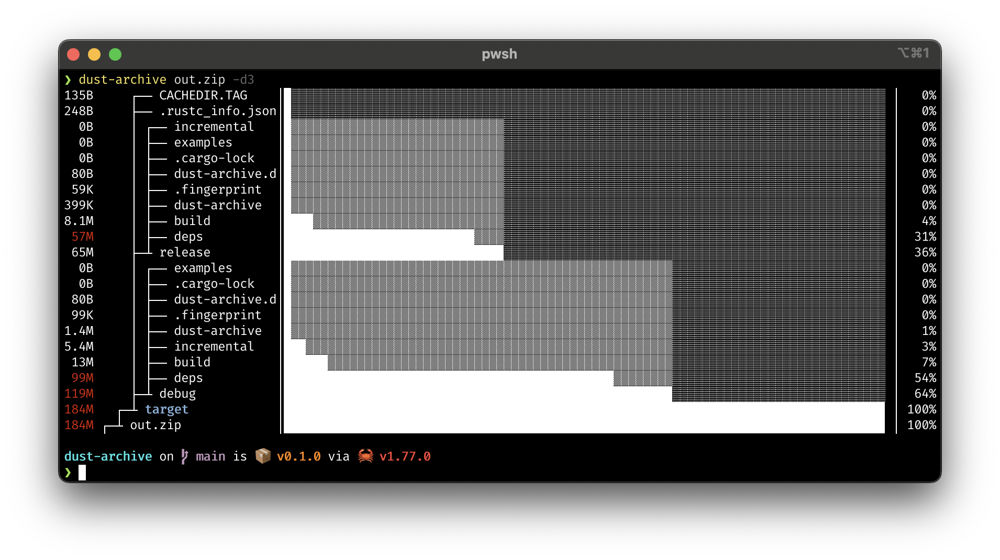

# dust-archive

Print compressed sizes of archives in a tree-like format.

It uses the same tree rendering as [dust](https://github.com/bootandy/dust), which is a more intuitive friendly version of du.

Supports these formats:
* zip using [zip](https://github.com/zip-rs/zip)
* 7z using [sevenz-rust](https://github.com/dyz1990/sevenz-rust)

## Installing

`cargo install --git https://github.com/domsleee/dust-archive`